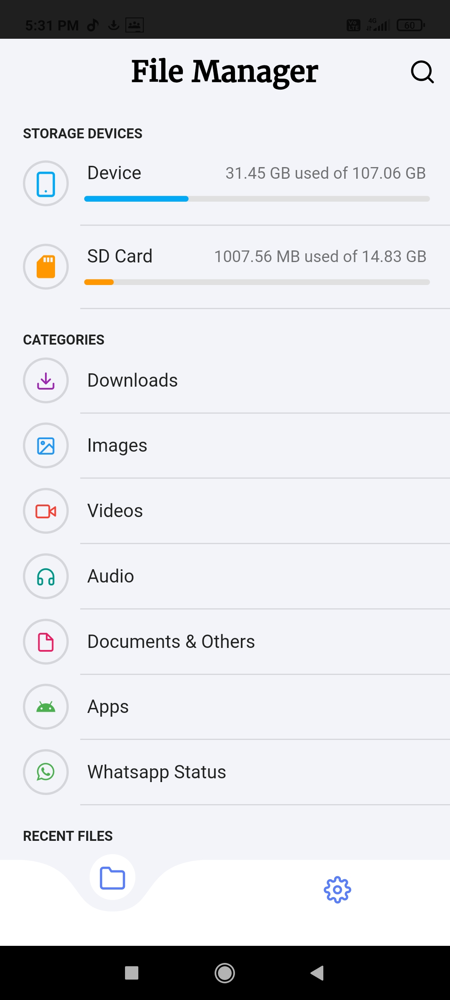
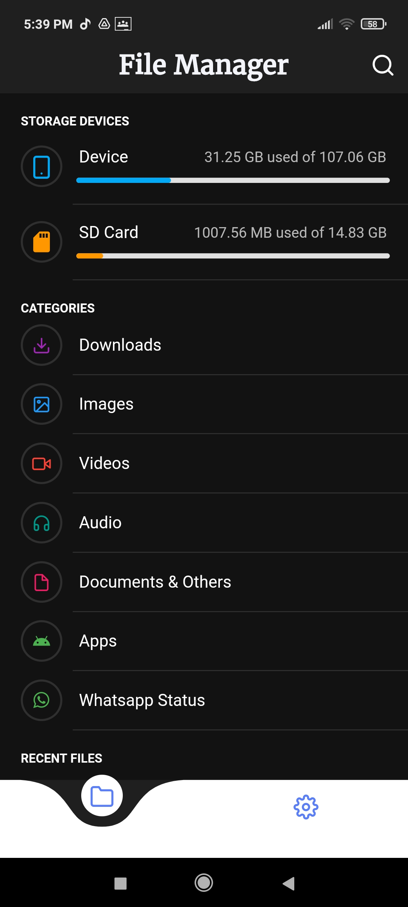
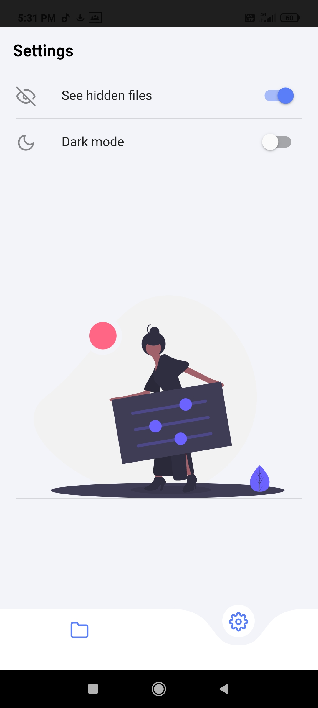
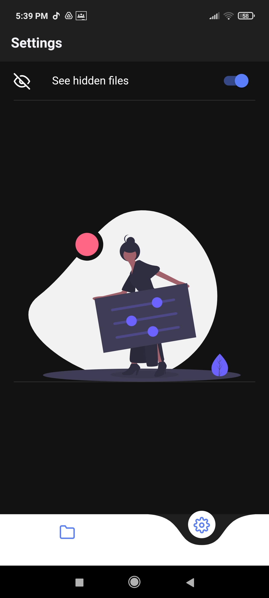

# File-Manager

   A normal file manager app done using Flutter with Rich UI that allows the user to edit, view, copy, delete and create files on your Android/iOS Device.
   File Manager helps the user view and manage their files, it’s the operating system that’s responsible for accessing and storing the files.
   It allows users to search for the required files seamlessly.
## ✨ Features
- [x] Recent Files.
- [x] Search Files.
- [x] Sort Files.
- [x] Show/Hide Hidden files.
- [ ] Copy/Move/Paste Files.
- [x] Delete Files/Folders.
- [x] Rename Files/Folders.
- [x] Dark Mode.
- [x] Whatsapp Status Saver.
- [x] Fingerprint unlock for secured files.

## ✨ Screenshots:
   |||
   |||
   |||

## Minor bugs are spotted
